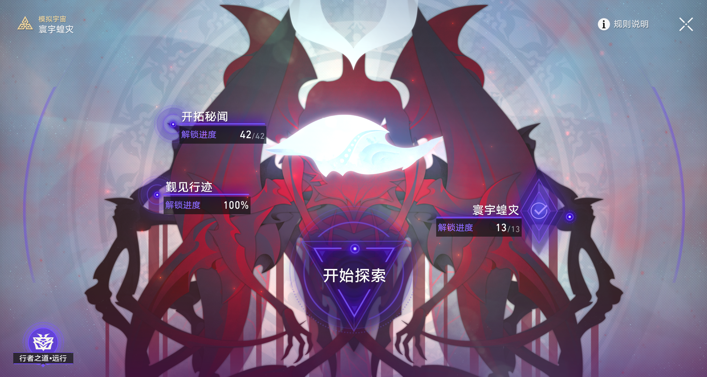
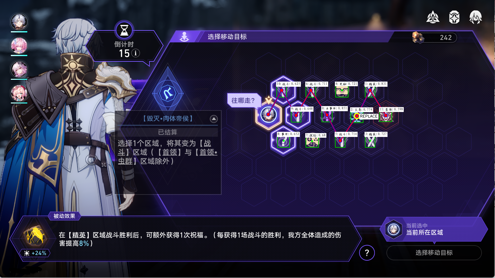
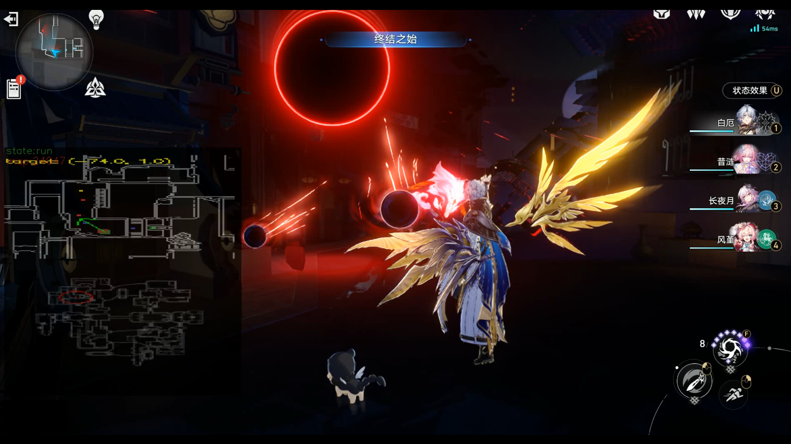
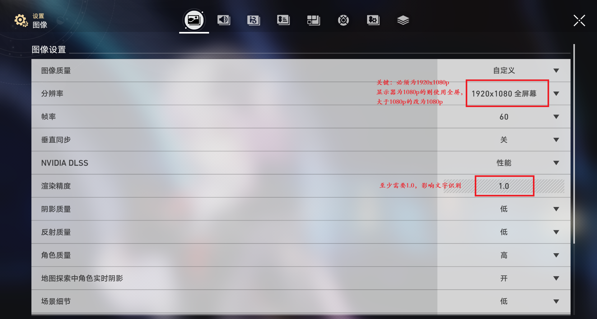

[简体中文](README.md) | [繁體中文](README_CHT.md) | [English](README_ENG.md)

# Simulated Scepter | Simulated_Scepter
Simulated Scepter ω - u13.exe
This software is open-sourced under the [AGPL 3.0 License](LICENSE).

An automated assistant for the ultra-difficult achievement "Iron Warrior" in "Honkai: Star Rail", providing one-click automation to help you complete it.


The software is based on image recognition and does not support any non-legitimate cheating functions (such as packet capture, reverse engineering).

Before asking questions... you need to read [How to ask](https://github.com/ryanhanwu/How-To-Ask-Questions-The-Smart-Way/blob/main/README.md)


----------------------------------------------------------------------------------------------

# Disclaimer

### 1. Software Nature and Open Source Statement
This software is an external open-source auxiliary tool designed to automate gameplay by simulating user operations and interacting with the game's existing user interface (UI). This software is designed to interact with the game only through the existing user interface and will not modify any game files or game code in any way. This software is open-source and free, intended solely for personal learning, communication, and research into automation technology. The developer team reserves the final interpretation rights of this project.

### 2. Intellectual Property and Ownership Statement
All intellectual property rights, including copyrights and trademarks, of the game "Honkai: Star Rail" and its related content legally belong to miHoYo and its affiliated entities. This software serves only as a technical learning tool and does not claim or enjoy any copyright of the game content.

### 3. Scope of User License
All functions obtained through this software are strictly limited to the sole purpose of "personal temporary learning and research" and do not constitute any express or implied commercial use authorization for users. Users shall not use this software in any form, directly or indirectly, for commercial profit, promotion, training, paid boosting services, or other similar scenarios.

### 4. User Obligations and Compliance Risk Warning
4.1 When using this software, users must comply with national laws and regulations and the user agreement published by miHoYo. Before using this software, users have fully understood and acknowledged the clear provisions in miHoYo's ["Honkai: Star Rail" Fair Play Declaration](https://sr.mihoyo.com/news/111246?nav=news&type=notice):

> "The use of cheats, accelerators, scripts, or other third-party tools that disrupt game fairness is strictly prohibited."
> "Once discovered, miHoYo (hereinafter referred to as 'we') will take measures such as deducting illegal gains, freezing game accounts, or permanently banning game accounts, depending on the severity and frequency of violations."

4.2 Users fully understand and agree that using this software may be considered by miHoYo as a violation of the above regulations, which may result in penalties including but not limited to warnings, deduction of gains, temporary suspension, or even permanent ban of the game account. All consequences and responsibilities arising therefrom shall be borne solely by the user.

### 5. Third-Party Boosting Service Risk Warning
If users encounter merchants using this software for paid boosting services, please note: the fees charged by such merchants may be for equipment wear and tear, time costs, etc., and are unrelated to the software itself. All problems, disputes, and consequences arising from accepting such boosting services, including but not limited to account bans, loss of virtual property, personal information leakage, or fraud by merchants, are not associated with this software or the developer team.

### 6. Risk Assumption and Liability Exemption
6.1 The operator/developer team makes no express or implied warranties of any kind regarding the functional availability, stability, security, compatibility, or error-free operation of the software.

6.2 Any direct or indirect losses, legal disputes, equipment damage, data loss, game account penalties, or other risks suffered by users due to obtaining or using this software, regardless of the cause, shall be borne entirely by the users themselves, and the operator/developer team shall not be held liable.

6.3 The operator/developer team assumes no obligation to supervise, guarantee, mediate, or compensate for users' usage behavior. All issues arising from the use of this software are unrelated to this project and the developer team.

6.4 Any behavior by users that violates the usage restrictions of this agreement and laws and regulations constitutes a breach of contract. Users shall independently bear all civil, administrative, and even criminal liabilities arising therefrom, and compensate for all losses caused to the operator/developer team or other third parties.

### 7. Agreement Effectiveness and Final Interpretation
The act of downloading, installing, or using this software by users constitutes complete understanding and irrevocable consent to all terms of this agreement. The final interpretation rights of all terms of this agreement and the operational management rights of the software belong to the developer team. The developer team has the right to unilaterally change the content of this agreement or terminate the service when necessary, without prior individual notification to users.

----------------------------------------------------------------------------------------------

# Features | Function

## Intelligent Path Selection  



## Precise Target Locking  



## Advanced Features

### Video Recording  

In the name of love, treasure everything that has passed away...

### Early Reset  

If this world cannot bring salvation, then bring it destruction... (In plain language: restart if achieving 40 kills seems hopeless)

## Map Frequency Analysis  
```plaintext
sqlite3 config/backup/map_visits.db "SELECT * FROM map_visits ORDER BY visit_count DESC;"
```
----------------------------------------------------------------------------------------------

## Compatibility

Only supports 1080p and above screens (x>=1920, windowed or fullscreen), HDR disabled, text language set to Simplified Chinese, game interface must not have any obstructions, and must be in the foreground.

Due to the onnxruntime environment, please ensure Windows 10 version is greater than or equal to 2004 (Windows 11 is supported by default). It is recommended to have more than 2GB of VRAM to run this software.

The download and extraction directory cannot have a Chinese path!!
# Download | Download 
Method 1: Go to the QQ group to directly download the packaged release version (recommended) * 

Method 2: Download the source code and deploy locally. If you have no experience with Python, please ignore the following tutorial and go directly to the QQ group to download related resources.

**Quick Deployment**

```plaintext
uv sync
uv run new_gui.py
```
----------------------------------------------------------------------------------------------

# Configuration Recommendations

It is recommended to place characters in the first slot in the following order: Bai'e, Huangquan, or other ranged basic attack characters. Characters in other slots can be arbitrary. The team needs at least 3 members for the script to run properly.

PLEASE NOTE!!!!! Do not move the game window after starting execution/calibration! Avoid incorrect script execution!! If you need to move it, press F5 to stop automation first!

### Calibration

Sometimes the view angle may rotate too much or too little, causing navigation issues. You can try manual calibration:

Enter the game, teleport your character to Herta's Office, then click the calibration button in the GUI, and wait for the view rotation/spinning in place to complete.

Changing mouse DPI may affect calibration values, requiring recalibration at that time.

## GUI Usage Instructions

**First Run**

Adjust your system settings according to the system configuration images below. In the game, set "Automatically Apply Battle Settings", and select your team characters in the Destruction lineup on the Swarm Disaster interface.

**Run Scepter**

Click "Promote Iron Warrior" to run.

NOTE!!!!! Do not move the game window after starting execution/calibration! If you need to move it, stop automation first!

Press F5 or the "Stop Task" button to stop execution.

**System Settings**




----------------------------------------------------------------------------------------------

# Development Communication - Player Community - Aid Destruction | Destruction
* Contains stable releases of this Scepter system.
* 

----------------------------------------------------------------------------------------------

# Support Development | Star or Buy Coffee

### Give a Star - If you find this project helpful, please give it a free Star in the upper right corner. Thank you!

### WeChat Donation


# Acknowledgements

This project uses the following excellent open-source libraries and tools:

## Core Dependencies

- **[OpenCV](https://opencv.org/)** - Image processing and computer vision library, used for image recognition, template matching, and minimap analysis
- **[NumPy](https://numpy.org/)** - Scientific computing library, providing efficient array operations and numerical computation support (OpenCV dependency)
- **[Pillow](https://python-pillow.org/)** - Python image processing library, used for image loading and processing
- **[PyAutoGUI](https://pyautogui.readthedocs.io/)** - Automation control library, implementing simulated mouse and keyboard operations
- **[pywin32](https://github.com/mhammond/pywin32)** - Windows API interface, used for window management and system-level operations
- **[keyboard](https://github.com/boppreh/keyboard)** - Global keyboard listening and control library

## OCR and Deep Learning

- **[ONNX Runtime](https://onnxruntime.ai/)** - Cross-platform machine learning inference engine, supporting DirectML acceleration, used for PaddleOCR model inference

## GUI Framework

- **[PyQt5](https://www.riverbankcomputing.com/software/pyqt/)** - Python bindings for the Qt framework, building graphical user interfaces

## Data Processing and Configuration

- **[PyYAML](https://pyyaml.org/)** - YAML parser, used for configuration file management
- **[Shapely](https://shapely.readthedocs.io/)** - Geometric object manipulation library, used for spatial analysis and path planning
- **[pyclipper](https://github.com/greginvm/pyclipper)** - Polygon clipping library, used in conjunction with OCR
- **[SciPy](https://scipy.org/)** - Scientific computing library, used for signal processing and minimap analysis
- **[Matplotlib](https://matplotlib.org/)** - Data visualization library, used for debugging and data analysis (development/testing dependency)
- **[ipykernel](https://ipython.org/)** - Jupyter kernel support (development/testing dependency)

## Related Open Source Projects
- **[Auto_Simulated_Universe](https://github.com/CHNZYX/Auto_Simulated_Universe/)** - Core foundation of this project, significantly refactored based on this project
- **[StarRailCopilot](https://github.com/LmeSzinc/StarRailCopilot/)** - Inspiration for advanced state machine architecture, high-precision map positioning
